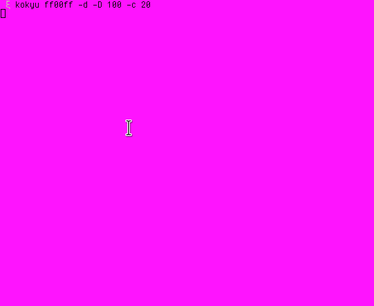

<h1 align="center">kokyu 呼吸 🌸🗻</h1>

<p align="center">Add some zen to your terminal!</p>
<br><br>
<p align="center"></p>

**About:**

```kokyu``` is a simple python program that will slowly pulse the colors of your terminals in a sort of "breathing" pattern

**Why?**

I created ```kokyu``` because I was tired of staring at a solid color text-mode terminal all day, and I wanted to add some vibrancy to my rice without using anything too distracting

**How does it work?**

```kokyu``` looks at all of the open terminals in ```/dev/pts/``` and sends a special escape sequence containing the current color to each one.

To make sure that your terminal supports the escape sequences needed, run ```printf "\033]11;#ffff00\007"```. You terminal's background color should now be a solid yellow color (yuck!)

**Installation:**

```
git clone http://github.com/geremachek/kokyu
cd kokyu/
pip install --user .
```

**Usage:**

```
usage: kokyu [-h] [-D DELAY] [-c CYCLES] [-b | -d] COLOR

Add some zen to your terminal

positional arguments:
  COLOR                 Hexadecimal color

optional arguments:
  -h, --help            show this help message and exit
  -D DELAY, --delay DELAY
                        Time (in milliseconds) between color changes
  -c CYCLES, --cycles CYCLES
                        How many 'cycles' to run before returning to the original color
  -b, --bright          'Bright' breathing
  -d, --dark            'Dark' breathing
```
